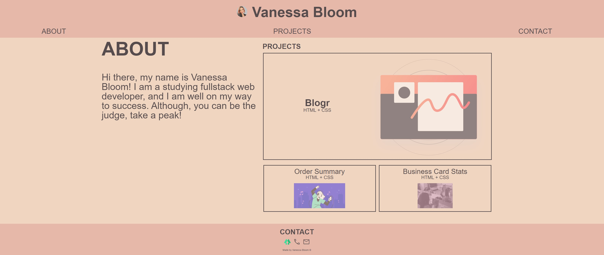
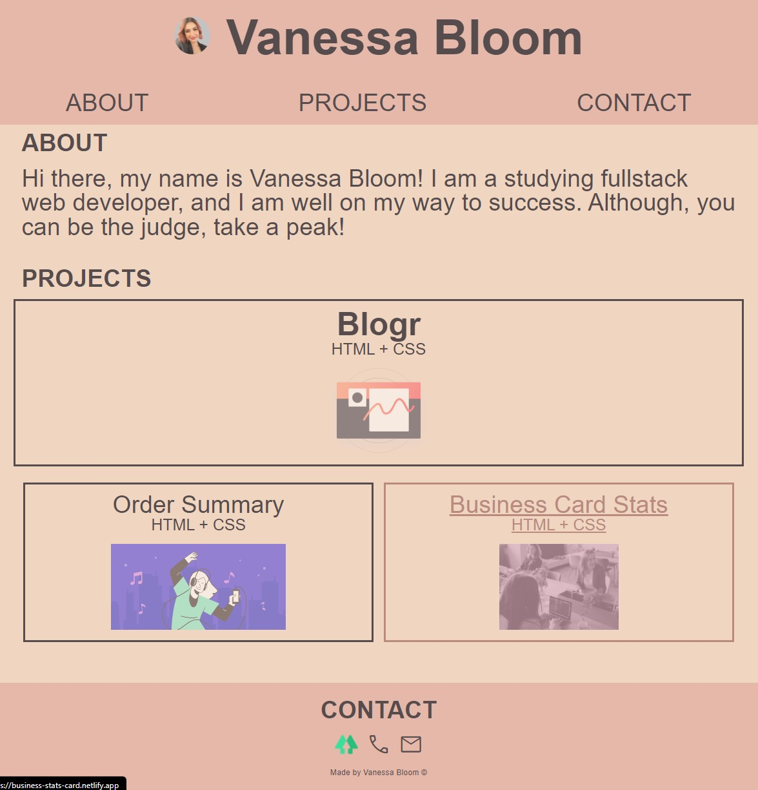
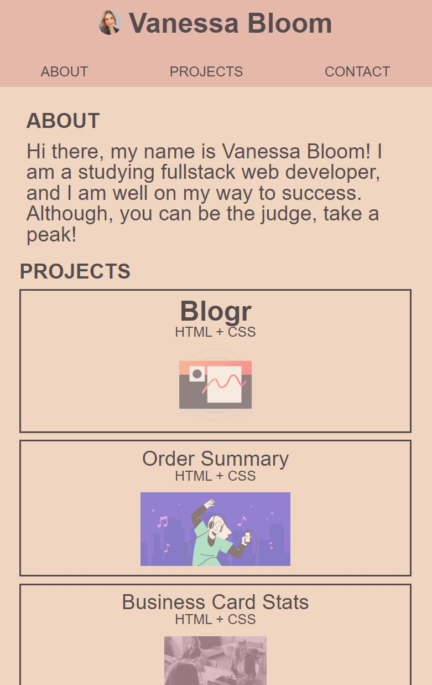

# Portfolio-Challenge-02

Portfolio

Created: index.html, style.css, reset.css

Copied reset.css from class activity 11.

# Description

Firstly I drew quick mock ups of each viewport design on paper. Then I created the HTML, CSS, and copied the reset.css from one of the class activies. I quickly found myself eager to complete this page! I love applying what I have learnt, and I have thoroughly enjoyed applying myself to this assignment. I spent a lot of time googling different terms and questions. Things like making sure I use semantic HTML, and additionaly I also learnt things like flex-basis and applied them to the page. I was self teaching and followed a few "front end mentor" free designs - these are linked as my projects. Thanks for checking this out :) Vanessa.

# Screenshots:

# Links:

Github repo: https://github.com/NessJade96/Portfolio-Challenge-02
Webpage deploy: https://nessjade96.github.io/Portfolio-Challenge-02/

# Commit notes:

Commit 1:
Created website content in index.html. Created style.css and added in formatting. Added reference colour scheme. added Linktree png and a selfie photo. Created project-one main img and link to page. Added the Contact Me at the bottom of the screen. All of this was for mobile view.

Commit 2:
Gave all projects working links, and also links in the NAV bar working. Changed the header and created a flex container around the name and img.

Commit 3:
Created a sticky nav bar at the top of my website. Changed the background colour for the sticky header.
About section - added text align justify.
Projects - input images for all projects, gave the images an opcaity, created a headline for projects.
Contact -moved the linktree link to my contact section in my footer. Added icon for phone and icon for email. Created links so they open straight to call or open the email. Added a copyright. added the same background colour for the header as the footer.

Commit 4:
Added in the <main> and deleted a bunch of unnecessary styling - cleaning up the CSS.
Rearranged footer and adding in a google font icon to upgrade the 'CONTACT' icons.
Added before pseudo element to IDs that the Nav links which added a gap at the top of the page and is not hidden behind the sticky nav. Changed the color of the links when hovered over using a pseudo selector.

Commit 5:
Upped the first project font weight and font size to highlight this project.
Now that I have the colours and everything for my mobile site, I am now going to optimise the CSS code and add variables on colours. Removed the "text-align: justify" from my About.
Planning to make the relative viewports I am updating my sizes from % to rem as this will relate better when sizing my website larger. Added the text align to the contact in the footer. Added comments to create a CSS index for easy readibiliy - complete restructure of CSS formatting, includes adding extra ID and Class tags.

Commit 6:
Created media queries adjust CSS to style the table size website 768px. Increased font sizing and added a container around the secondary projects to include flex. Lastly, I changed the pseudo margin-top and height was increased to allow for the growth in size.

Commit 6:
The final changes on the desktop/1024px media query. I added flex containers to the main image to restructure the contents using flex. Increased the text on the article to fill space. Also added in the media query to provide a max width to maintain styling.

Commit 7:
Wrote my about me section. Double checked marking criteria and finalised the ReadMe.
